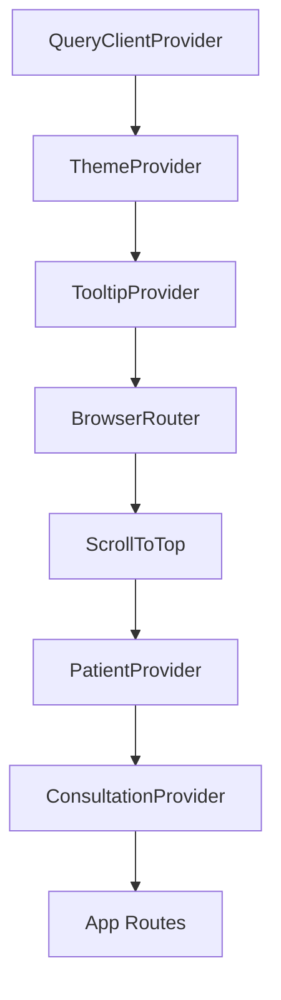

# 🏥 Medscope — Project Context & Architecture

> **Smarter care for patients and doctors.**
> Medscope is a premium, AI-powered healthcare & wellness platform bridging physical health and mental wellbeing. Designed for both patients and healthcare providers, it delivers intelligent medicine analysis, live consultations, reminders, mental wellness tracking, and robust emergency protocols.

---

## 🧭 Project Purpose & Target Workflows

Medscope addresses core friction points in personal health management and patient-doctor engagement. The platform serves two primary personas via distinct, tailored portals:

### 1. Patient Portal
*   **Intelligent Onboarding**: A 5-step onboarding wizard to capture basic vitals, health conditions, lifestyle habits, and emergency preferences.
*   **Bento-Grid Dashboard**: An interactive dashboard consisting of 11 self-contained widgets (e.g., vitals, next medicine countdown, mood tracking, upcoming consultations). Supports responsive column collapsing.
*   **AI Medicine Analysis & Chat**:
    *   **Scan Rx**: Upload prescription images for AI-based medicine analysis (timings, dosage, classification).
    *   **Ask AI**: Converse with a conversational health assistant for symptoms guidance.
*   **Reminder Vault**: Comprehensive CRUD scheduler for Medicines, Meals, Water, Appointments, and Wellness reminders. Includes a 1-hour snooze option.
*   **Mental Wellness Hub**: Emoji-based mood logging and interactive tracking with data visualization.
*   **Emergency Mode (SOS)**: A prominent Floating Action Button (FAB) and dedicated emergency page for instant SOS trigger, emergency contacts, and vital medical cards.
*   **Multi-Modal Consultations**: Video, Audio, Chat, and In-Clinic booking with historical diagnosis notes.

### 2. Doctor Portal
*   **Doctor Onboarding**: 5-step onboarding covering credentials, qualifications, availability schedule, and consultation rates/preferences.
*   **Professional Dashboard**: Manage consultation queues, view automated symptom/patient pre-visit insights, and toggle assistant permissions for administrative tasks.

---

## 🛠️ Technology Stack & Dependencies

Medscope is built using modern, highly performant web technologies. For detailed dependency versions, refer to the [package.json](file:///c:/Users/htale/OneDrive/Desktop/medscopepu/package.json).

| Layer | Technologies | Purpose |
| :--- | :--- | :--- |
| **Core Framework** | React 18, Vite 5 (SWC), TypeScript | Component UI structure, fast HMR, and strict typing |
| **Routing** | React Router DOM v6 | Single-Page Application routing map with 20+ routes |
| **Styling & UI** | TailwindCSS 3, ShadCN/UI, Radix UI, `@liquidglass/react` | Modern, fully responsive utility layout, accessible component primitives, and premium glassmorphic cards |
| **State Management** | React Context API | Global state persistence (profile, reminders, consultations) |
| **Animations** | Framer Motion | Fluid entrance/stagger animations |
| **AI / OCR** | Groq LLM, Tesseract.js + OCR.space | Clinical AI microservices; dual-engine optical scanning (offline primary, cloud fallback) |
| **Form Handling** | React Hook Form, Zod | Type-safe schema validation for authentication and onboarding forms |
| **Data Viz** | Recharts | Interactive trend charting for health scores and mood tracking |
| **Security** | CryptoJS (AES-256) | Client-side encryption for Personal Health Information (PHI) |
| **Testing** | Vitest, Playwright | Component unit tests and cross-browser End-to-End verification |

---

## 🏗️ Core Architecture & Hierarchy

### 1. Global Contexts & Providers
Application state flows through a tree of React providers configured in [App.tsx](file:///c:/Users/htale/OneDrive/Desktop/medscopepu/src/App.tsx):



*   **[PatientContext.tsx](file:///c:/Users/htale/OneDrive/Desktop/medscopepu/src/context/PatientContext.tsx)**: Manages patient profile information, custom dashboard widget ordering/config, and reminders CRUD state.
*   **[ConsultationContext.tsx](file:///c:/Users/htale/OneDrive/Desktop/medscopepu/src/context/ConsultationContext.tsx)**: Manages the active doctor directory, upcoming/past consultations, and appointment scheduling actions.

### 2. High-Level Folder Layout
```
medscope/
├── public/                 # Static assets (favicons, robots.txt)
├── src/
│   ├── main.tsx            # Application entry point
│   ├── App.tsx             # Route registry and state provider tree
│   ├── index.css           # Design tokens (HSL colors, custom animation keyframes)
│   ├── context/            # React global context providers
│   ├── components/         # Shared UI and layout blocks
│   │   ├── patient-dashboard/ # Bento grid widgets and navigation components
│   │   ├── onboarding/     # Patient onboarding steps
│   │   ├── ui/             # Radix primitives and decorative components
│   │   └── landing/        # Marketing landing sections (Hero, Features, Footer)
│   ├── pages/              # Routing endpoint components (Auth, Dashboard, ScanRx, etc.)
│   ├── lib/                # Storage utils, styling hooks, and encryption wrappers
│   └── test/               # Vitest component test suites
├── vite.config.ts          # Build configuration
└── tailwind.config.ts      # Custom Tailwind styling & layout config
```

---

## 🎨 UI/UX Design System & Psychology

Medscope applies key UX principles to establish trustworthiness and ease-of-use in a healthcare context:

> [!TIP]
> **Aesthetic-Usability Effect**
> Frosted-glass components (`GlassCard`), neon glowing borders (`glow-primary`), and fluid micro-animations build high perceived trust. The dark mode default palette (`224 35% 6%` deep navy background) minimizes eye strain while keeping a clean, clinical aesthetic.

*   **Hick's Law (Minimized Friction)**: The 5-step onboarding wizards split massive forms into digestible steps. The dashboard groups functions into a bento layout with quick-action tiles to prevent cognitive overload.
*   **Von Restorff Effect (Isolation)**: High-priority triggers—like the **Emergency SOS button**—use pulsing red glow animations to immediately capture the user's attention in high-stress scenarios.
*   **Zeigarnik Effect (Progress Loops)**: Interactive daily task timelines and profile completeness gauges encourage users to keep details up-to-date.
*   **Fitts's Law (Accessible Interaction)**: Key touchpoints conform to a mobile-first philosophy with a bottom-docked navigation bar, large thumb-friendly button hit-boxes, and an accessible floating SOS action.

---

## 🔐 Security & Client-Side Encryption

Because Medscope handles sensitive Personal Health Information (PHI), data security is strictly enforced at rest and in transit:

> [!IMPORTANT]
> **AES-256 LocalStorage Encryption**
> To safeguard patient details, vitals, and reminders, all data stored in `localStorage` is encrypted using **AES-256** via `CryptoJS` in the utility library **[secureStorage.ts](file:///c:/Users/htale/OneDrive/Desktop/medscopepu/src/lib/secureStorage.ts)**. 
> 
> *   Key management relies on a secure environment variable: `VITE_SECURE_STORAGE_KEY`.
> *   On startup, legacy unencrypted/Base64 test data is automatically migrated to AES.
> *   Vite dev server is configured with strict security headers (e.g., `X-Frame-Options: DENY`).

---

## 🧪 Testing & Verification

The codebase maintains a robust test suite to prevent regressions:

*   **Unit and Component Tests (Vitest)**: Tests component behaviors, hooks, and context utilities using a simulated browser environment.
    ```bash
    npm run test          # Executes all test suites once
    npm run test:watch    # Runs Vitest in interactive watch mode
    ```
*   **End-to-End Tests (Playwright)**: Verifies critical flows (authentication, onboarding, reminders) in Chromium, Firefox, and WebKit browsers.
    ```bash
    npx playwright test   # Launches the E2E test runner
    ```

---

## 🗺️ Key Routing Reference

Below is a quick reference mapping of key path segments:

| Path Segment | Page Component | Purpose |
| :--- | :--- | :--- |
| `/` | `Index` | Product landing and marketing page |
| `/auth/select-role` | `SelectRole` | Entry path selecting patient or doctor workflows |
| `/patient/signup` | `PatientSignup` | Patient account creation |
| `/patient/onboarding` | `OnboardingPage` | Profile initialization wizard |
| `/patient/dashboard` | `PatientDashboard` | Core bento-grid patient dashboard |
| `/patient/scan-rx` | `ScanRxPage` | Prescriptions scanning page |
| `/patient/ask-ai` | `AskAIPage` | Chat Interface with AI assistant |
| `/patient/reminders` | `RemindersPage` | Comprehensive reminders vault |
| `/patient/consultations` | `ConsultationsPage`| Doctor directory & video consultation launcher |
| `/doctor/onboarding` | `DoctorOnboardingPage` | Doctor onboarding credentials check |
